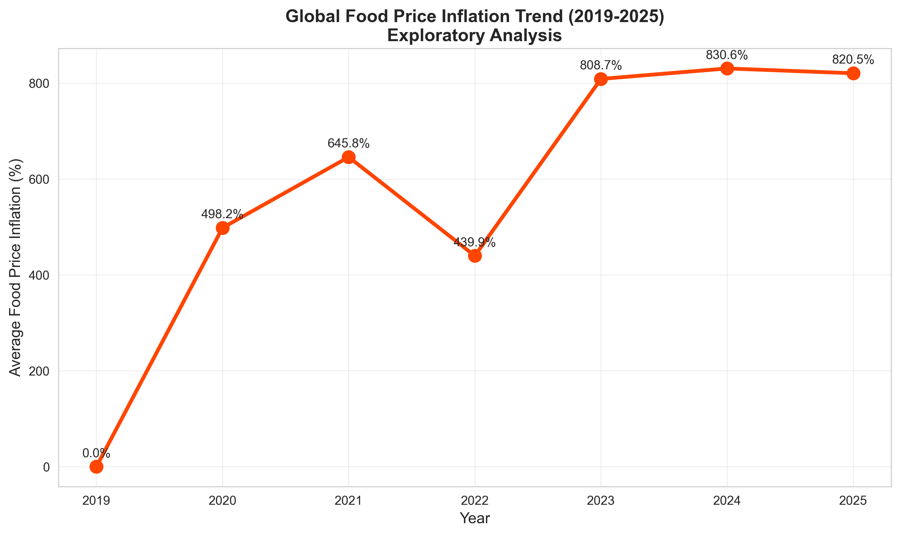
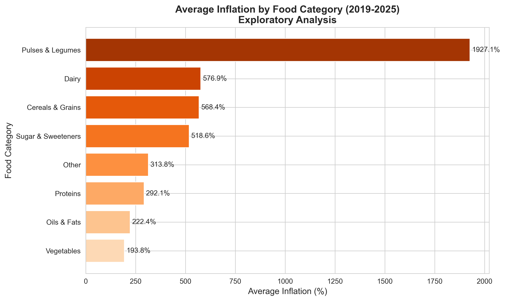

# Global Food Crisis Analysis (2019–2025)


**Which countries were hit hardest by rising food prices after 2019, and which foods drove it?**

This project combines **2.01 million World Food Programme market-price records** (94 countries, 830 commodities, Jan 2019 – Nov 2025) with World Bank inflation and GDP data. It measures how much food prices rose in each country and food category against a 2019 baseline, and presents the 50 most affected countries in an interactive Tableau dashboard.

Data Management & Visualisation module, MSc in Computing (Data Analytics), Dublin City University.

<p align="center">
  
</p>

---

## Key findings

| Rank | Country | Avg. food-price increase vs 2019 | General CPI inflation (avg) |
|---|---|---|---|
| 1 | Nicaragua | 17,860% | 6.2% |
| 2 | Zimbabwe | 6,472% | 253.9% |
| 3 | Tanzania | 5,984% | 3.6% |
| 4 | Lebanon | 3,913% | 113.4% |
| 5 | Dominican Republic | 2,156% | 5.7% |
| 6 | Sudan | 1,852% | 178.0% |
| 7 | Syria | 1,443% | n/a |
| 8 | Zambia | 771% | 14.0% |
| 9 | Kenya | 680% | 6.1% |
| 10 | South Sudan | 667% | 35.8% |

- **The shock is concentrated.** Across 90 countries, the *median* increase is 33%, but 18 countries exceed 100%. A small group of crisis-hit and economically unstable countries dominates the top of the table.
- **Prices kept climbing.** The median country-level increase over 2019 grew every year: 9% in 2020, 43% in 2022 and 91% in 2025. The sharpest jump comes in 2022, the year of the Ukraine war, when the median more than doubled from 18% to 43%.
- **Staples were hit hardest.** Pulses & legumes show the largest average increase, followed by dairy, and then cereals & grains.
- **Food inflation is not the same as headline inflation.** Zimbabwe, Lebanon and Sudan track currency collapse and high CPI. Nicaragua and Tanzania show extreme food-price moves despite low general inflation (see Limitations).

<p align="center">
  
  
</p>

---

## Pipeline

```
WFP market prices (7 yearly files, 2.01M rows)      World Bank WDI
          │                                    (CPI inflation, GDP per capita)
          ▼                                               │
 Clean: date filter 2019–2025, drop missing prices        │
 Map ISO3 → country names (94 countries)                  │
 Categorise 830 commodities → 8 food groups               │
          │                                               │
 Median price per country × year × category               │
 % change vs each country's 2019 baseline                 │
          └──────────────────► merge on country + year ◄──┘
                                   │
               Country summaries · Top-50 selection · category breakdown
                                   │
                    Tableau-ready CSVs → interactive dashboard
```

**Food categories:** Cereals & Grains, Pulses & Legumes, Proteins, Dairy, Vegetables, Oils & Fats, Sugar & Sweeteners, and Other.

---

## Repository structure

```
food-crisis-analysis-main/
├── Python_Scripts/
│   └── Food_Crisis_Data_Processing.ipynb   # full processing + exploratory charts
├── Processed_Data/
│   ├── food_crisis_master.csv              # country × year × category (2,655 rows)
│   ├── country_summary_all.csv             # 90 countries
│   ├── country_summary_top50.csv
│   ├── category_breakdown_top50.csv
│   ├── tableau_ready_data.csv              # dashboard source (1,739 rows)
│   └── exploratory_*.png                   # exploratory charts
├── Tableau_Files/
│   └── Global_Food_Crisis_Analysis.twbx    # interactive dashboard
└── Raw_Data/                               # raw downloads go here (not committed)
```

---

## Reproduce it

```bash
git clone https://github.com/ahireniket33/Food-crisis-Analysis.git
pip install pandas numpy matplotlib seaborn requests jupyter
```

1. **WFP Global Food Prices:** download the yearly files for 2019–2025 from [HDX](https://data.humdata.org/dataset/wfp-food-prices) into `Raw_Data/WFP/`. The notebook can also fetch them automatically from the HDX metadata files.
2. **World Bank WDI:** download inflation (`FP.CPI.TOTL.ZG`) and GDP per capita (`NY.GDP.PCAP.CD`) from [data.worldbank.org](https://data.worldbank.org/) as `inflation_data.csv` and `gdp_data.csv` into `Raw_Data/WorldBank/`.
3. Update `BASE_PATH` in the notebook, then run `Food_Crisis_Data_Processing.ipynb`.
4. Open `Tableau_Files/Global_Food_Crisis_Analysis.twbx` in Tableau Desktop or Tableau Public to explore the dashboard.

---

## Limitations

- **Mixed units and currencies.** Prices are nominal and in local currency, so countries with currency collapse (Zimbabwe, Lebanon, Sudan) show very large increases that partly reflect devaluation.
- **Changes in the commodity basket.** Inflation is computed on the *median* price of all commodities in a category. If a country's reported basket shifts over time (different items, units or markets), the median can jump even when individual prices haven't changed that much. This probably inflates outliers such as Nicaragua and Tanzania, where general CPI stayed low.
- **Coverage gaps.** Some countries (Syria, South Sudan) lack World Bank CPI or GDP data, and 2025 covers only part of the year.

A natural next step would be to compute inflation per individual commodity and unit, convert prices to USD or real terms, and aggregate afterwards.

---

## Tech stack

Python 3.10 · pandas · NumPy · Matplotlib · Seaborn · requests · Jupyter · Tableau Desktop 2024.3

## Authors

- **Niket Ahire**: data gathering, processing pipeline, exploratory analysis · [LinkedIn](https://www.linkedin.com/in/niket-ahire-512178291) · [GitHub](https://github.com/ahireniket33)
- **Robert Borkar**: visualisation design, Tableau implementation, critical analysis

MSc in Computing (Data Analytics), Dublin City University.
